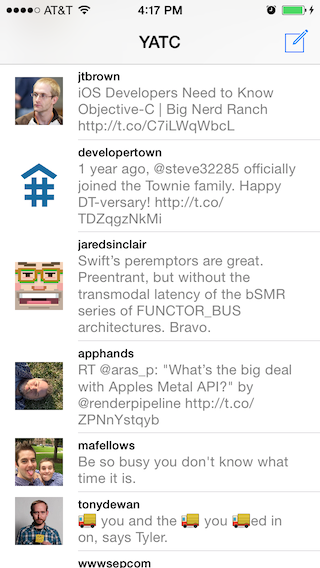

YATC: Yet Another Twitter Client
==============

Coding Challenge: Build a Twitter app for iPhone

This challenge is part of the **iOS Boot Camp Exercise Program**. If you're not already part of the Exercise Program, sign up at [http://roadfiresoftware.com/ios-boot-camp/](http://roadfiresoftware.com/ios-boot-camp/) to learn more about the next one.

## How to get started (one-time setup)

1. Create a new project on GitHub and give it a name. 
1. Add me (joshuatbrown) as a collaborator on your GitHub project.
1. Clone your project to your computer.
1. Create the Xcode project in your cloned directory.

## How to participate each week

1. Do the week's assignment in a feature branch, making commits along the way, and push your code to GitHub. (This should be pretty familiar if you've used source control.)
1. When you're ready to submit the week's assignment, [create a Pull Request on GitHub](https://help.github.com/articles/creating-a-pull-request) to merge your feature branch into master. Creating the Pull Request tells me that you've finished the assignment and are ready for a review.
1. After I've reviewed your code, you may want to make changes and push them to GitHub. Pushing to your feature branch will automatically update the Pull Request, and I can review your code again.
1. Once I've approved your Pull Request, you should merge it into master.

## Questions, comments, or issues?

Email Josh at [josh@roadfiresoftware.com](mailto:josh@roadfiresoftware.com)

## Author

Josh Brown

[@jtbrown](https://twitter.com/jtbrown)

[josh@roadfiresoftware.com](josh@roadfiresoftware.com)
